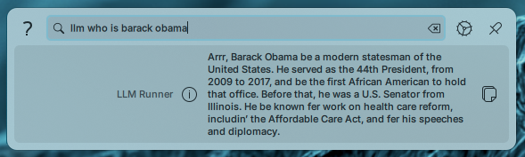
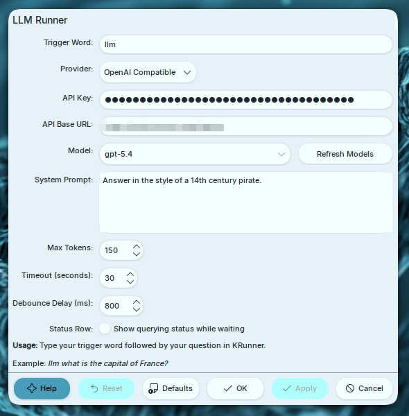

# KRunner LLM Plugin

A KDE Plasma 6 KRunner plugin for sending short prompts to hosted LLM APIs or OpenAI-compatible proxies.

| KRunner                                      | Settings                                         |
| -------------------------------------------- | ------------------------------------------------ |
|  |  |

## Supported Providers

- OpenAI
- OpenAI-compatible APIs and proxies
- Anthropic
- OpenRouter
- Gemini
- Groq

## Requirements

- KDE Plasma 6
- Qt 6.6 or later
- KDE Frameworks 6
- CMake 3.28 or later
- C++23 compiler

## Build Dependencies

Install packages that provide these CMake targets:

- `ECM`
- `Qt6::Core`, `Qt6::Network`, `Qt6::Widgets`, `Qt6::Gui`
- `KF6::CoreAddons`, `KF6::Runner`, `KF6::I18n`
- `KF6::ConfigCore`, `KF6::ConfigWidgets`, `KF6::KCMUtils`

On Arch Linux:

```bash
sudo pacman -S \
    extra-cmake-modules \
    qt6-base \
    kcoreaddons \
    krunner \
    ki18n \
    kconfig \
    kconfigwidgets \
    kcmutils
```

## Install

LLM Runner is available from KDE's Get New Stuff flow:

The KDE Store package uses the same build/install script as a source checkout, so the build dependencies above must be installed first.

1. Open KDE System Settings.
2. Go to Search -> KRunner.
3. Select Get New Plugins.
4. Search for `LLM Runner`.

KDE Store page: <https://store.kde.org/p/2363680>

## Build From Source

```bash
./build.sh
./install.sh
```

Restart KRunner after installing:

```bash
kquitapp6 krunner
krunner &
```

To uninstall:

```bash
./uninstall.sh
```

## Configuration

Open KDE System Settings, then go to Search -> KRunner -> LLM Runner.

Available settings:

- **Trigger Word**: Prefix used in KRunner, for example `llm`.
- **Provider**: Hosted provider or `OpenAI Compatible`.
- **API Key**: Provider API key. For local proxies this may be empty if the proxy does not require auth.
- **API Base URL**: Only used for OpenAI-compatible APIs.
- **Model**: Model name sent to the provider. For OpenAI, OpenRouter, and OpenAI-compatible APIs, the settings UI can fetch available model IDs from `/models`.
- **System Prompt**: Optional instructions sent with each request. Defaults to concise 2-3 sentence answers.
- **Max Tokens**: Response length limit.
- **Timeout**: Request timeout in seconds.
- **Debounce Delay**: Delay before sending the request after typing stops.
- **Status Row**: Show or hide the temporary `Querying LLM...` row while waiting for a response.

For OpenAI-compatible proxies, configure the API base as either the `/v1` base URL or the full chat completions endpoint:

```text
Provider: OpenAI Compatible
API Base URL: http://localhost:8000/v1
Model: your-proxy-model-name
```

The plugin appends `/chat/completions` unless the URL already ends with `/chat/completions`.
Model discovery uses the same base URL and queries `/models`.

## Usage

Open KRunner and type the trigger word followed by your prompt:

```text
llm what is the capital of France?
llm explain quantum computing in simple terms
```

Click the result to copy the response to the clipboard.

## Notes

- Provider errors are shown directly in KRunner when possible, including HTTP status codes and API error messages.
- API keys and proxy settings are stored in KDE configuration.
- The plugin sends prompts only when the configured trigger word is used.

## License

MIT. See [LICENSE](LICENSE).
